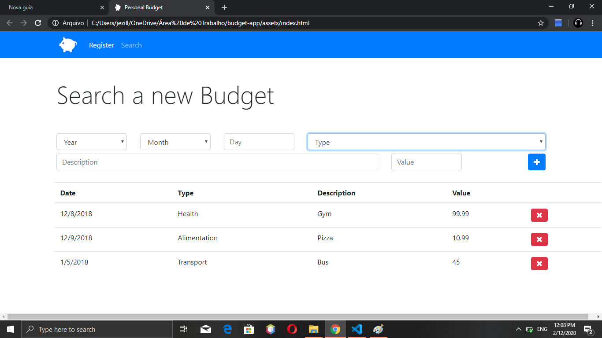

<h2>App Orçamento Pessoal</h2>

Site Web com o objetivo de registrar dinamicamente despesas de todo tipo do usuário, para se ter uma organização de suas despesas, assim colocando-se data, tipo, valor e etc...

<h3>Ferramentas Usadas</h3>

<ul>
   <li>JavaScript(Conceitos Básicos e ES6 para cima, como Orientação a Objeto e outros conceitos do ECMAScript 6)</li>
   <li>CSS</li>
   <li>HTML</li>
</ul>      

Obviamente após os dados das despesas serem inseridos eles continuam armazenados na página, utilizando LocalStorage do navegador web.

   
   
   

Obs: Caso a pagina trave o problema é causado pelo armazenamento em localStorage, que foi ultilizado por medidas didáticas, mas não sendo o aconselhado a ser usado para armazenamento dos dados, para corrigir só limpar o localStorage.

